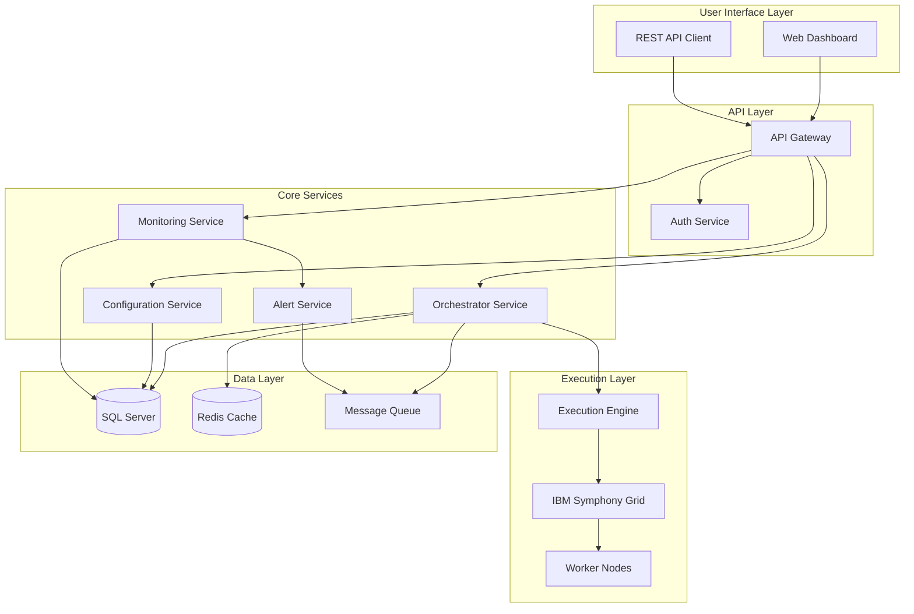
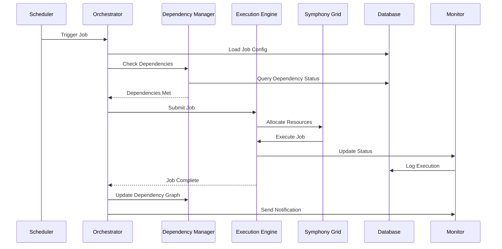

# Batch Job Orchestration System Architecture

## Executive Summary
This document describes the architecture of a comprehensive batch job orchestration system designed to replace Autosys in a banking environment. The system emphasizes database-driven configuration, fault tolerance, and operational simplicity.

## System Overview

### Core Design Principles
1. **Database-Driven Configuration**: All job configurations stored in SQL Server
2. **No Code Deployment for Configuration Changes**: Business users can modify job parameters without IT involvement
3. **Fault Tolerance**: Built-in retry mechanisms, circuit breakers, and graceful degradation
4. **Audit Trail**: Complete logging of all job executions, state changes, and user actions
5. **Scalability**: Leverages IBM Symphony Grid for distributed execution
6. **Real-time Monitoring**: REST APIs and dashboard for operational visibility

## Architecture Components

### 1. Core Orchestrator Service
- **Technology**: Spring Boot 3.x, Java 17
- **Responsibilities**:
  - Job scheduling and triggering
  - Dependency resolution
  - State management
  - Resource allocation

### 2. Execution Engine
- **Technology**: IBM Symphony Grid integration
- **Responsibilities**:
  - Distributed job execution
  - Resource management
  - Load balancing
  - Failure handling

### 3. Configuration Management Service
- **Technology**: Spring Data JPA with SQL Server
- **Responsibilities**:
  - CRUD operations for job definitions
  - Version control for configurations
  - Parameter validation
  - Change audit logging

### 4. Monitoring & Alerting Service
- **Technology**: Spring Boot with WebSocket support
- **Responsibilities**:
  - Real-time job status updates
  - Alert generation and routing
  - Performance metrics collection
  - SLA monitoring

### 5. REST API Gateway
- **Technology**: Spring Cloud Gateway
- **Responsibilities**:
  - Unified API access point
  - Authentication/Authorization
  - Rate limiting
  - Request routing

## Component Interaction Flow



## Job Execution Workflow



## High Availability Design

### Active-Active Configuration
- Multiple orchestrator instances running simultaneously
- Distributed locking using database or Redis
- Load balanced API access
- Session replication across instances

### Failover Strategy
1. **Primary-Secondary Model**: For critical singleton services
2. **Distributed Processing**: For job execution across Symphony Grid
3. **Database Clustering**: SQL Server Always On Availability Groups
4. **Circuit Breaker Pattern**: Prevents cascading failures

## Security Architecture

### Authentication & Authorization
- **LDAP/AD Integration**: For enterprise SSO
- **Role-Based Access Control (RBAC)**: Granular permissions
- **API Key Management**: For service-to-service communication
- **Audit Logging**: All configuration changes and job executions

### Data Security
- **Encryption at Rest**: Database encryption
- **Encryption in Transit**: TLS 1.3 for all communications
- **Sensitive Data Masking**: PII/PCI data protection
- **Secret Management**: Integration with enterprise vault

## Performance Considerations

### Scalability Targets
- Support for 10,000+ job definitions
- Execute 1,000+ concurrent jobs
- Sub-second job triggering latency
- 99.99% availability SLA

### Optimization Strategies
1. **Database Query Optimization**: Indexed tables, query caching
2. **Connection Pooling**: Optimized database connections
3. **Asynchronous Processing**: Non-blocking job submission
4. **Resource Pooling**: Reusable Symphony Grid resources

## Disaster Recovery

### Backup Strategy
- **Configuration Backup**: Hourly database snapshots
- **Job State Backup**: Real-time replication
- **Log Archival**: 90-day retention policy

### Recovery Procedures
1. **RPO (Recovery Point Objective)**: < 1 hour
2. **RTO (Recovery Time Objective)**: < 4 hours
3. **Automated Failover**: For critical components
4. **Manual Intervention Points**: Documented procedures

## Migration Strategy from Autosys

### Phase 1: Discovery & Analysis (Weeks 1-2)
- Inventory existing Autosys jobs
- Document dependencies and schedules
- Identify critical path jobs

### Phase 2: Configuration Migration (Weeks 3-4)
- Automated script to convert JIL to new format
- Database population with job definitions
- Validation of migrated configurations

### Phase 3: Parallel Run (Weeks 5-8)
- Run new system in shadow mode
- Compare outputs with Autosys
- Performance tuning

### Phase 4: Gradual Cutover (Weeks 9-12)
- Migrate non-critical jobs first
- Monitor and stabilize
- Complete migration of critical jobs

### Phase 5: Decommission (Week 13)
- Final validation
- Autosys shutdown
- Documentation update

## Technology Stack Summary

### Core Technologies
- **Runtime**: Java 17 (LTS)
- **Framework**: Spring Boot 3.x, Spring Cloud
- **Database**: SQL Server 2019+
- **Caching**: Redis (optional)
- **Grid Computing**: IBM Symphony Grid
- **Build Tool**: Maven/Gradle
- **Container**: Docker (optional)

### Monitoring Stack
- **Metrics**: Micrometer + Prometheus
- **Logging**: SLF4J + Logback
- **Tracing**: Spring Cloud Sleuth
- **Dashboards**: Custom Spring Boot Admin

## Deployment Architecture

### VM Deployment Model
```
┌─────────────────────────────────────────────────────┐
│                   Load Balancer                      │
└─────────────────────────────────────────────────────┘
                          │
        ┌─────────────────┼─────────────────┐
        │                 │                 │
┌───────▼──────┐ ┌────────▼──────┐ ┌───────▼──────┐
│   VM Node 1  │ │   VM Node 2   │ │   VM Node 3  │
├──────────────┤ ├───────────────┤ ├──────────────┤
│ Orchestrator │ │ Orchestrator  │ │ Orchestrator │
│ Config Mgmt  │ │ Config Mgmt   │ │ Config Mgmt  │
│ Monitor      │ │ Monitor       │ │ Monitor      │
│ API Gateway  │ │ API Gateway   │ │ API Gateway  │
└──────────────┘ └───────────────┘ └──────────────┘
        │                 │                 │
        └─────────────────┼─────────────────┘
                          │
┌─────────────────────────▼─────────────────────────┐
│              IBM Symphony Grid Cluster             │
│  ┌──────────┐ ┌──────────┐ ┌──────────┐          │
│  │ Worker 1 │ │ Worker 2 │ │ Worker N │          │
│  └──────────┘ └──────────┘ └──────────┘          │
└────────────────────────────────────────────────────┘
                          │
┌─────────────────────────▼─────────────────────────┐
│           SQL Server Cluster (Always On)           │
└────────────────────────────────────────────────────┘
```

## Operational Model

### Support Tiers
1. **L1 Support**: Monitor dashboards, restart jobs
2. **L2 Support**: Configuration changes, troubleshooting
3. **L3 Support**: Code fixes, infrastructure issues

### Maintenance Windows
- **Planned Maintenance**: Monthly, 2-hour window
- **Emergency Patches**: As needed with approval
- **Configuration Changes**: No downtime required

## Success Metrics

### Technical KPIs
- Job success rate > 99.5%
- Average job latency < 5 seconds
- System availability > 99.99%
- Configuration deployment time < 5 minutes

### Business KPIs
- Reduction in change requests by 80%
- Operational cost reduction by 40%
- Mean time to resolution < 30 minutes
- User satisfaction score > 4.5/5

## Risk Mitigation

### Identified Risks
1. **Symphony Grid Integration Complexity**: Mitigated by POC and vendor support
2. **Data Migration Errors**: Mitigated by parallel run and validation
3. **Performance Degradation**: Mitigated by load testing and capacity planning
4. **Skill Gap**: Mitigated by training and documentation

### Contingency Plans
- Rollback procedures for each migration phase
- Autosys kept in standby mode for 30 days post-migration
- Escalation matrix defined for critical issues