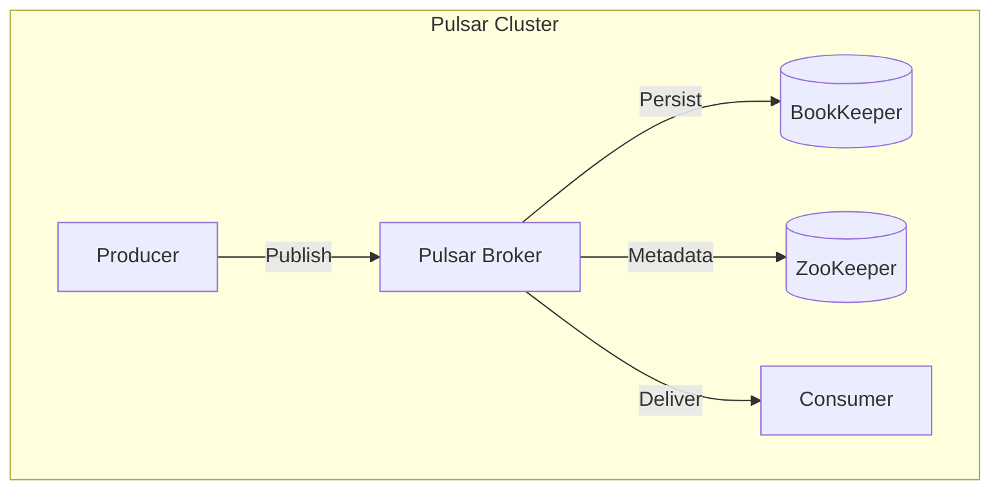
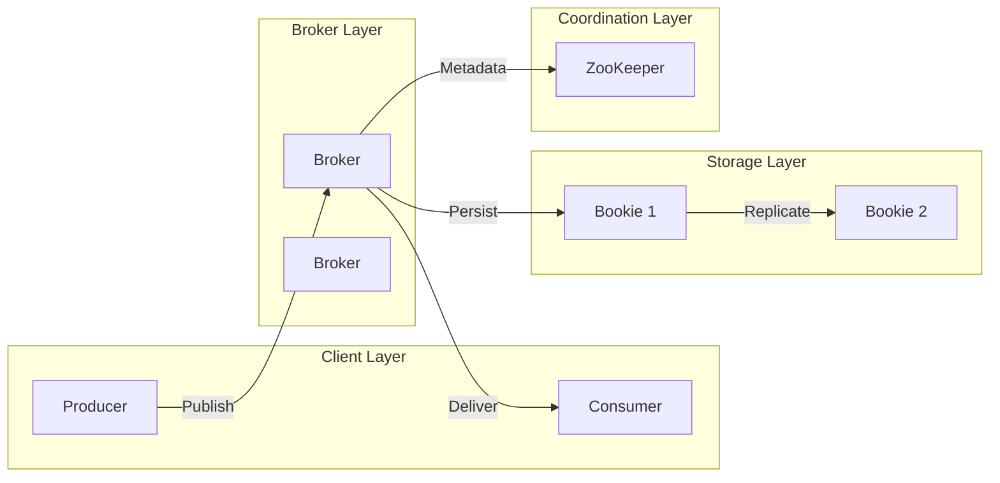
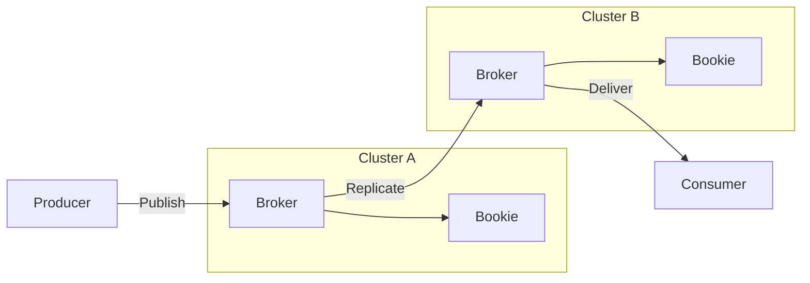

# Apache Pulsar: A Distributed Pub-Sub Messaging System

## Table of Contents
1. [Introduction](#introduction)  
2. [Key Features](#key-features)  
3. [Core Components](#core-components)  
4. [Architecture Design](#architecture-design)  
5. [Data Flow in Pulsar](#data-flow-in-pulsar)  
6. [Use Cases](#use-cases)  
7. [Comparison with Other Systems](#comparison-with-other-systems)  

---

## Introduction
Apache Pulsar is a **cloud-native, distributed** pub-sub messaging and streaming platform designed for **high performance, scalability, and durability**. It unifies messaging (like RabbitMQ) and streaming (like Kafka) into one system.

---

## Key Features
✔ **Multi-tenancy** – Isolated namespaces for teams/apps.  
✔ **Low Latency & High Throughput** – Optimized for real-time use cases.  
✔ **Geo-Replication** – Built-in cross-datacenter replication.  
✔ **Persistent Storage** – Apache BookKeeper for durability.  
✔ **Unified Model** – Supports both queuing and streaming.  

---

## Core Components

### 1. **Pulsar Brokers**
- Stateless components handling message routing and protocol translation.

### 2. **Apache BookKeeper**
- Distributed **write-ahead log (WAL)** for persistent storage.

### 3. **ZooKeeper**
- Manages cluster metadata and coordination.

### 4. **Pulsar Proxy (Optional)**
- Gateway for clients in cloud environments.

---

## Architecture Design

### High-Level Overview

### Detailed Component Diagram

---

## Data Flow in Pulsar

### Geo-Replication Example

### Steps:
1. **Producer** publishes to a topic via a **Broker**.
2. **Broker** persists messages in **BookKeeper** (with replication).
3. **Consumer** subscribes and receives messages.
4. **ZooKeeper** manages metadata and failovers.

---

## Use Cases
1. **Real-Time Analytics** – IoT, fraud detection.  
2. **Microservices Communication** – Decoupled services.  
3. **Data Pipeline** – Replace Kafka with Pulsar’s Kafka API.  
4. **Serverless Computing** – Pulsar Functions for lightweight processing.  

---

## Comparison with Other Systems
| Feature          | Pulsar              | Kafka               | RabbitMQ           |
|------------------|---------------------|---------------------|--------------------|
| **Messaging Model** | Pub-Sub + Queuing | Pub-Sub             | Queuing            |
| **Storage**      | BookKeeper          | Local Disk          | Memory/Disk        |
| **Geo-Replication** | Built-in         | MirrorMaker         | Plugins            |

---

## Conclusion
Apache Pulsar’s **layered architecture** (compute-storage separation) and **multi-tenancy** make it ideal for cloud-native event streaming. Its Mermaid diagrams visualize:
- Stateless brokers.
- Durable BookKeeper storage.
- Built-in geo-replication.
